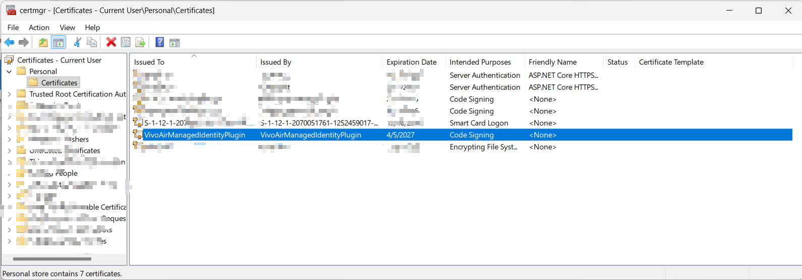
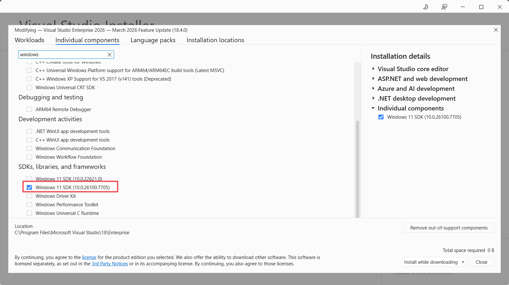
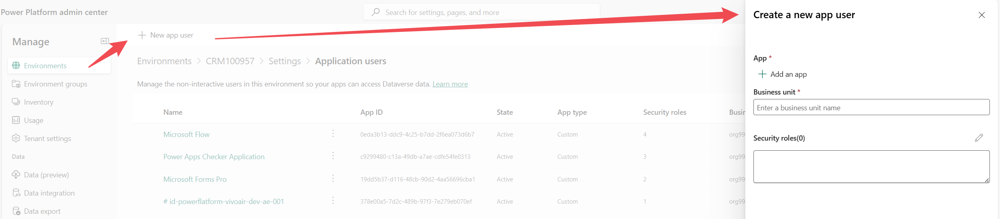

Managed Identities are the natural evolution of service principals because they completely eliminate the need to manage and store secrets. 

Integrations can be either inbound or outbound. This article will focus on outbound integration—specifically, using a Managed Identity to allow Power Platform (Dataverse) plugins to securely call external Azure resources.

### Overall Goal
The primary purpose of configuring a Managed Identity (MI) is so that Microsoft Entra ID will trust the calling plugin assembly. This allows your custom Dataverse code to securely authenticate against external Azure services without embedding credentials.

### Step-by-Step Implementation

- Certificate: Generate the `.pfx` file containing the key pair.
- Certificate: Import the `.pfx` into the Windows certificate store.
- Azure: Create a user-assigned managed identity.
- Dataverse: Create an application user and link it to the managed identity record.
- Dataverse: Assign the required security roles.
- Development: Build the plugin `.dll`.
- Security: Sign the assembly using the generated certificate.
- Deployment: Upload the signed assembly to Dataverse.
- Configuration: Link the assembly with the managed identity in Dataverse.
- Azure: Add federated credentials and role assignments with the Azure managed identity.
- Validation: Test the integration.

### Generate a Self-Signed Certificate
Your certificate must contain a key pair (both private and public keys) to sign the assembly. Below is a PowerShell example to generate one.

```powershell
$kuCodeSigning = "1.3.6.1.5.5.7.3.3";

$cert = New-SelfSignedCertificate `
  -Type "CodeSigningCert" `
  -KeyExportPolicy "Exportable" `
  -Subject "VivoAirManagedIdentityPlugin" `
  -KeyUsageProperty @("Sign") `
  -KeyUsage @("DigitalSignature") `
  -TextExtension @("2.5.29.37={text}$($kuCodeSigning)", "2.5.29.19={text}false") `
  -CertStoreLocation "Cert:\CurrentUser\My" `
  -KeyLength 2048 `
  -NotAfter ([DateTime]::Now.AddYears(1)) `
  -Provider "Microsoft Software Key Storage Provider";

$emptyPassword = [System.Security.SecureString]::new()

Export-PfxCertificate `
  -Cert "Cert:\CurrentUser\My\$($cert.Thumbprint)" `
  -FilePath "$env:TEMP\VivoAirManagedIdentityPlugin.pfx" `
  -Password $emptyPassword;
```

The `ku` in `kuCodeSigning` stands for key usage. The example provided in standard [Microsoft documentation](https://learn.microsoft.com/en-us/power-platform/admin/set-up-managed-identity) is typically for secure email signage, which is not designed for signing plugin assemblies. The OID `1.3.6.1.5.5.7.3.3` explicitly ensures it is valid for code signing.

You need to register the keys of the generated `.pfx` file within the Windows certificate storage. Ensure it is placed in both the Personal and Trusted Root Certification Authorities nodes for successful signing.


### Signing Tool
Use the Windows SDK SignTool to apply the certificate to your assembly.


### Create a Managed Identity Record in Dataverse
You can establish this link by creating an application user in the Power Platform admin center.


### Calling Managed Identity for Bear Token
```CSharp
        public string GetToken(List<string> scopes)
        {
            return _managedIdentityService.AcquireToken(scopes);
        }
```

### Add Federated Security in Azure
When configuring the federated credentials in Azure, the subject string is used to pinpoint the intended caller plugin assembly. Note that the expected subject format has changed from v1 to v2.

### Managed Identity Basics
There are two types of Managed Identities: System-Assigned and User-Assigned. For Power Platform plugins connecting to Azure, we create and utilize a User-Assigned Managed Identity.

## References
- [Set up managed identity for Power Platform Plugins](https://www.clive-oldridge.com/azure/2024/10/14/set-up-managed-identity-for-power-platform-plugins.html)
- [Power Platform Plugin Package – Managed identity](https://www.clive-oldridge.com/azure/2024/11/22/power-platform-plugin-package-managed-identity.html)
- [Set up Power Platform managed identity for Dataverse plug-ins or plug-in packages](https://learn.microsoft.com/en-us/power-platform/admin/set-up-managed-identity)
- [SignTool.exe (Sign Tool)](https://learn.microsoft.com/en-us/dotnet/framework/tools/signtool-exe)
- [New-SelfSignedCertificate](https://learn.microsoft.com/en-us/powershell/module/pki/new-selfsignedcertificate?view=windowsserver2025-ps#example-3)

## Future Posts
- Managed Identity with Plugin Packages
- Managed Identity with vNet and apim