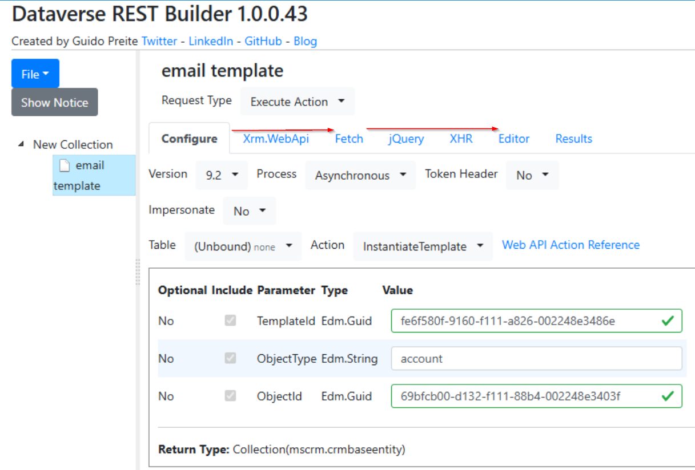
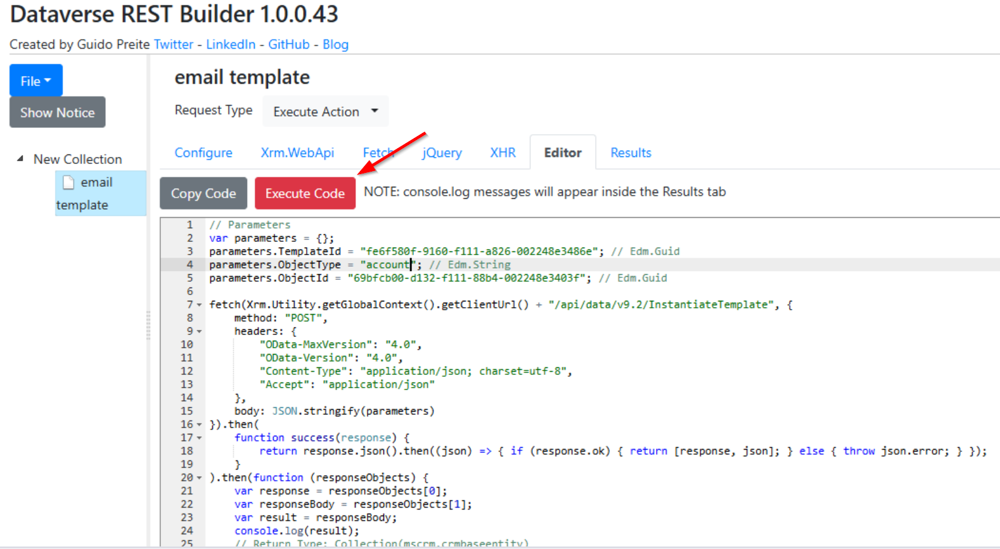

Dynamics 365 email templates let you create reusable email content with dynamic text that auto-populates from record data. Here's a practical guide to working with them effectively.

## Entity-Specific Templates

Entity-specific templates are tied to a particular table (entity) and can resolve fields from that table automatically via the template editor UI. However, there is a significant limitation: **you cannot create entity-specific email templates for custom entities** through the standard UI. This restricts their usefulness in solutions with heavy customisation.

## Global Templates

Global templates are not bound to any specific entity, which makes them more flexible. To use dynamic text with custom entities in a global template, you need to manually write the mapping syntax.

**Text fields:**

```
{!EntityLogicalName:FieldLogicalName;}
```

Example — pulling a user's address:

```
{!User:Address;}
```

**Lookup fields** (to resolve the display name):

```
{!EntityLogicalName:LookupFieldLogicalName/@name;}
```

**Tip:** If your syntax is correct, the dynamic value placeholder will turn yellow in the template editor after saving. If it stays plain text, double-check your entity and field logical names. For example, is the column doesn't exist in the table or spelling errors.

## How to Test a Template

There are a few approaches to validate that your template resolves correctly:

1. **Manual test** — Create an email record, insert the template, and set the regarding record. Confirm the placeholders resolve to actual values.

2. **InstantiateTemplate action** — Call the `InstantiateTemplate` Dataverse action programmatically. Tools like the **Dataverse REST Builder** XrmToolBox plugin can help. The workflow in REST Builder is: build the request in *Configure* mode → switch to *Fetch* mode to generate the request code → move to *Editor* mode to execute. It's not the most intuitive flow, but it works.




## Implementation Scenario(s)
**Power Automate** — Use an unbound action step in a cloud flow to call `InstantiateTemplate`. This is especially powerful for integrating with the rest of your business process or logic.

## Complex Data Mapping

When out-of-the-box dynamic text isn't enough (e.g., you need conditional logic, formatted dates, or data from related records beyond a single lookup), use **Power Automate**:

- Define your own placeholder syntax in the template body (e.g., `{{custom_placeholder}}`).
- Build a flow that retrieves the necessary data, performs transformations, and replaces your custom placeholders before sending the email.

This pattern gives you full control over the email content while still leveraging templates for the static structure.

## Reference

- [Email dynamic text - Microsoft Learn](https://learn.microsoft.com/en-us/power-apps/user/email-dynamic-text)
- https://himbap.com/blog/?p=4541